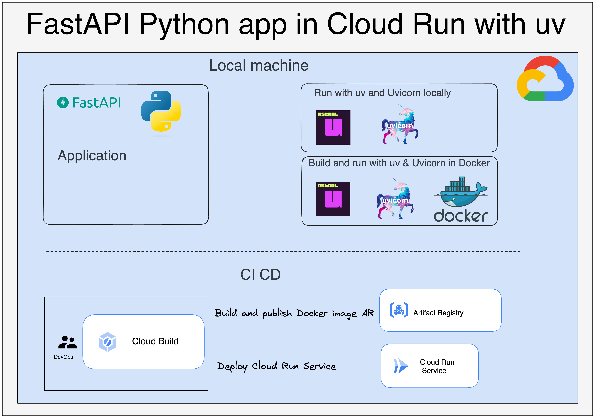

# uv-fastapi-cloudrun

This project demonstrates how to create a Python module with FastAPI, build it using [uv](https://github.com/astral-sh/uv)
— a fast and modern package manager — and deploy the application on Google Cloud Run.



## Local execution with Docker and gcloud CLI

Update `GCloud CLI` :

```bash
gcloud components update
```

### Launch the FastAPI app locally from uv

Install the Python packages with UV:

```bash
uv sync
```

Run the ASGI server with Uvicorn:

```bash
uvicorn team_league.service.main:app --reload --host 0.0.0.0 --port 8080
```

### Build the Docker image locally and publish it to Artifact Registry

Set env vars:

```bash
export PROJECT_ID={{project_id}}
export LOCATION=europe-west1
export SERVICE_NAME=teams-league-service
export REPO_NAME=internal-images
export IMAGE_TAG="latest"
```

Authenticate in GCP with ADC:

```bash
gcloud auth application-default login
```

Configure Docker to use your gcloud credentials
Use this command to configure Docker authentication for the registry:

```bash
gcloud auth configure-docker $LOCATION-docker.pkg.dev
```

Build the Docker image locally :

```bash
docker buildx build \
    -f team_league/service/Dockerfile \
    -t $LOCATION-docker.pkg.dev/$PROJECT_ID/$REPO_NAME/$SERVICE_NAME:$IMAGE_TAG \
    .
```

Run the application locally with Docker

```bash
docker run --rm -it \
    -p 8080:8080 \
    -e PROJECT_ID="$PROJECT_ID" \
    -e OUTPUT_DATASET="$OUTPUT_DATASET" \
    -e OUTPUT_TABLE="$OUTPUT_TABLE" \
    -e INPUT_BUCKET="$INPUT_BUCKET" \
    -e INPUT_OBJECT="$INPUT_OBJECT" \
    -v "$HOME/.config/gcloud:/home/teamleagueuser/.config/gcloud:ro" \
    $LOCATION-docker.pkg.dev/$PROJECT_ID/$REPO_NAME/$SERVICE_NAME:$IMAGE_TAG
```


Build the Docker image locally and publish it to Artifact Registry:

```bash
docker buildx build \
    -f team_league/service/Dockerfile \
    -t $LOCATION-docker.pkg.dev/$PROJECT_ID/$REPO_NAME/$SERVICE_NAME:$IMAGE_TAG \
    --push .
```

Be careful: Cloud Run supports only AMD (x86_64) architecture. 
If you're building the Dockerfile locally on an ARM-based machine, such as an M1 to M4 MacBook, 
the build won't work natively. In this case, you need to emulate an AMD environment during the build.

For AMD-based machines, the build commands work directly without any additional configuration.

In ARM architecture, you can emulate the AMD platform with Buildx:

```bash
docker buildx build \
    --platform linux/amd64 \
    -f team_league/service/Dockerfile \
    -t $LOCATION-docker.pkg.dev/$PROJECT_ID/$REPO_NAME/$SERVICE_NAME:$IMAGE_TAG \
    --push .
```

### Deploy the Cloud Run service locally, based in the image published previously

```bash
gcloud run deploy ${SERVICE_NAME} \
  --image europe-west1-docker.pkg.dev/${PROJECT_ID}/internal-images/${SERVICE_NAME}:latest \
  --region=${LOCATION}
```

## Request body for execute the Cloud Run service with FastAPI

An example of request body for the Cloud Run service:

```json
{
    "team_slogans": {
        "PSG": "Paris est magique",
        "Real": "Hala Madrid"
    }
}
```

## Execution from a CI CD pipeline and Cloud Build

### Execution from a CI CD pipeline and Cloud Build from local machine

Execution from a local machine with a Cloud Build yaml file :

```bash
gcloud builds submit \
    --project=$PROJECT_ID \
    --region=$LOCATION \
    --config deploy-cloud-run-service.yaml \
    --substitutions _REPO_NAME="$REPO_NAME",_SERVICE_NAME="$SERVICE_NAME",_IMAGE_TAG="$IMAGE_TAG",_OUTPUT_DATASET="$OUTPUT_DATASET",_OUTPUT_TABLE="$OUTPUT_TABLE",_INPUT_BUCKET="$INPUT_BUCKET",_INPUT_OBJECT="$INPUT_OBJECT" \
    --verbosity="debug" .
```

### Execution from a CI CD pipeline and a manual trigger in the Cloud Build page (GCP console)

Execution with a Cloud Build manual trigger :

```bash
gcloud beta builds triggers create manual \
    --project=$PROJECT_ID \
    --region=$LOCATION \
    --name="deploy-cloud-run-service-team-league-uv" \
    --repo="https://github.com/tosun-si/uv-fastapi-cloudrun" \
    --repo-type="GITHUB" \
    --branch="main" \
    --build-config="deploy-cloud-run-service.yaml" \
    --substitutions _REPO_NAME="$REPO_NAME",_SERVICE_NAME="$SERVICE_NAME",_IMAGE_TAG="$IMAGE_TAG",_OUTPUT_DATASET="$OUTPUT_DATASET",_OUTPUT_TABLE="$OUTPUT_TABLE",_INPUT_BUCKET="$INPUT_BUCKET",_INPUT_OBJECT="$INPUT_OBJECT" \
    --verbosity="debug"
```

The command line for automatic trigger on main + feature branches is:

```bash
gcloud builds triggers create github \
    --name=deploy-cloud-run-service-team-league-uv-auto \
    --region=europe-west1 \
    --repo-name=uv-fastapi-cloudrun \
    --repo-owner=tosun-si \
    --branch-pattern='^(main|feature.*)$' \
    --build-config="deploy-cloud-run-service.yaml" \
    --substitutions _REPO_NAME="$REPO_NAME",_SERVICE_NAME="$SERVICE_NAME",_IMAGE_TAG="$IMAGE_TAG",_OUTPUT_DATASET="$OUTPUT_DATASET",_OUTPUT_TABLE="$OUTPUT_TABLE",_INPUT_BUCKET="$INPUT_BUCKET",_INPUT_OBJECT="$INPUT_OBJECT" \
    --require-approval \
    --include-logs-with-status
```
